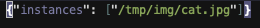
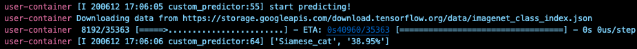
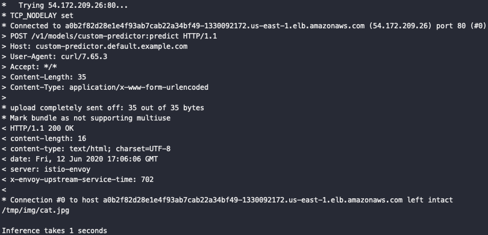

# README

## Objective

This test was conducted to incorporate the preprocessing code used in the Transformer into the Predictor without using the Transformer.

If you don't want to upload a separate Web server, KFServing.KFModel shall be used as is.

- In/Out : image file list
- InferenceService : user's custom image


## Process

* model : MobileNet

1. Custom Predictor Image build
```sh
docker build -t {USER}/{IMAGE}:{TAG} .
```

2. Push
```sh
docker push {USER}/{IMAGE}:{TAG}
```

3. Deploy
```sh
kubectl apply custom_deploy.yaml -n {NAMESPACE}
```

4. Inference
```sh
sh ./infer.sh
```


5. Result
* input



* prediction log



* output


