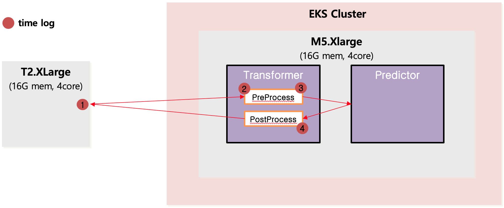

## 테스트 목표
* Kubeflow KFServing에 탑재된 모델을 이용해 이미지 처리시 Latency 향상을 위해 이미지 전송 방식 별로 이를 측정한다.  

## 테스트 시나리오
* Kubernetes Cluster 위에 KFServing을 구성하고 이미지 처리 모델을 탑재
* K8S Cluster와 같은 데이터 센터에 위치한 서버를 별도 구성 후 해당 서버에서 KFSerivng에 이미지 전송
* 이미지 전송 방식 : Curl, Kafka
* 측정 항목 : 구간별 도착 및 걸린 시간(Unix Time)
## 테스트 조건
* 환경 구성
    * AWS us-east-1
        * Curl 
        * Kafka 

* 전송 이미지
    * JPG 파일 > Base64 JSON 변환
        * 1.1MB > 1.5MB
        * 3.3MB > 4.6MB
        * 4.7mB > 6.4MB
        * 10.2MB > 13.9MB


## 테스트
* Curl
```sh
#!/bin/bash
StartTime=$(date +%s%N)

CLUSTER_IP=a0b2f82d28e1e4f93ab7cab22a34bf49-1330092172.us-east-1.elb.amazonaws.com
SERVICE_HOSTNAME=simple-mobilenet-transformer.default.example.com
INPUT_PATH=@./1mb.json
MODEL_NAME=simple-mobilenet-transformer
curl -v -H "Host: ${SERVICE_HOSTNAME}" http://$CLUSTER_IP/v1/models/$MODEL_NAME:predict -d $INPUT_PATH

EndTime=$(date +%s%N)
echo ""
echo "scale=3;$StartTime/1000000000" | bc
echo "scale=3;($EndTime-$StartTime)/1000000000" | bc
echo "scale=3;$EndTime/1000000000" | bc
```
* Kafka
```sh
#!/bin/bash
StartTime=$(date +%s%N)
./kafka_2.12-2.5.0/bin/kafka-console-producer.sh --broker-list localhost:9092 --topic mobilenet --producer.config ./kafka_2.12-2.5.0/config/producer.properties < 1mb.json
EndTime=$(date +%s%N)
echo ""
echo "scale=3;$StartTime/1000000000" | bc
echo "scale=3;$EndTime/1000000000" | bc
```

## 테스트 결과
### Curl
* unix time

|Size|1|2|3|4|
|:--:|:--:|:--:|:--:|:--:|
|1.1MB|1593068399.853|1593068399.898|1593068400.043|1593068400.276|
|4.6MB|1593068690.802|1593068690.936|1593068691.225|1593068691.455|
|6.4MB|1593068896.804|1593068897.041|1593068897.752|1593068898.053|
|13.9MB|1593069101.446|1593069102.001|1593069103.569|1593069103.85|

* seconds

|Size|2-1|3-2|4-3|4-1|
|:--:|:--:|:--:|:--:|:--:|
|1.1MB|0.045|0.007|0.145|0.423|
|4.6MB|0.134|0.019|0.289|0.653|
|6.4MB|0.237|0.023|0.711|1.249|
|13.9MB|0.555|0.050|1.568|2.404|

### Kafka
* unix time

|Size|1|2|3|4| 
|:--:|:--:|:--:|:--:|:--:|
|1.5MB|1593068580.163|1593068581.711|1593068581.843|1593068582.151|
|4.6MB|1593068694.818|1593068696.508|1593068696.818|1593068697.056|
|6.4MB|1593068902.721|1593068904.522|1593068905.2|1593068905.465|
|13.9MB|1593069107.124|1593069109.724|1593069111.241|1593069111.552|

* seconds

|Size|2-1|3-2|4-3|4-1|
|:--:|:--:|:--:|:--:|:--:|
|1.1MB|1.548|0.007|0.132|1.988|
|4.6MB|1.690|0.020|0.310|2.238|
|6.4MB|1.801|0.033|0.678|2.744|
|13.9MB|2.600|0.054|1.517|4.428|